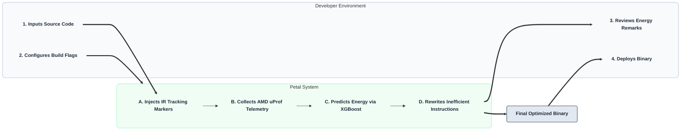

# Petal
**An Energy-Aware, Hardware-in-the-Loop Compiler Plugin for C/C++**

---

## Overview

Modern compilers optimize for execution speed or binary size, but they are entirely blind to the **physical energy consumption** of the silicon. As the industry scales toward massive AI data centers and edge IoT deployments, this "energy blind spot" results in massive, unnecessary power draw.

**Petal** bridges the gap between software engineers and hardware efficiency. It is an intelligent compilation pipeline that **profiles code using real-time AMD hardware telemetry**, **predicts energy costs via machine learning**, and **automatically transforms power-hungry LLVM Intermediate Representation (IR) into low-power equivalents**.

---

## The Architecture

Petal operates on a closed-loop **"Shift-Left" power optimization pipeline**, catching energy bloat at compile-time.



---

## Key Features

- **Hardware-in-the-Loop Telemetry:** Uses physical silicon feedback via AMD uProf (and Linux RAPL) rather than theoretical heuristics to measure true electrical cost.

- **Predictive ML Engine:** An XGBoost model, accelerated locally on the AMD Ryzen AI NPU, maps power spikes to specific LLVM IR blocks to create an "Energy Cost Dictionary."

- **Custom LLVM Green Pass:** Automatically swaps inefficient instruction sequences (e.g., cache-thrashing loops) with mathematically equivalent, cache-friendly structures.

- **LLVM Energy Remarks:** Educates developers by flagging specific lines of C/C++ source code that draw disproportionate wattage.

- **Automated ESG Compliance:** Generates a visual HTML dashboard proving the exact Joules saved per execution, seamlessly integrating into modern CI/CD pipelines.

---

## Technology Stack

| Layer | Technologies |
|---|---|
| **Compiler Infrastructure** | LLVM 22+, Clang (C/C++), ClangIR |
| **Machine Learning** | Python, XGBoost |
| **Hardware Telemetry** | AMD uProf CLI, Linux `perf` |
| **Reporting** | HTML5, Tailwind CSS, Chart.js |

---

## Repository Structure

```
petal-hackathon/
│
├── petal_build.py          # Core Python CLI wrapper & ML simulation engine
├── README.md               # Project documentation
│
├── src/                    
│   ├── target_naive.c      # Standard, high-power C algorithm (Baseline)
│   └── target_petal.c      # Cache-friendly, low-power C algorithm (Target)
│
└── report/                 
    ├── index.html          # Dynamic Tailwind/Chart.js energy dashboard
    └── petal_out           # Final compiled executable
```

---

## Quick Start (Demo MVP)

This repository contains the **Minimum Viable Product (MVP)** designed to demonstrate the Petal pipeline and visualization dashboard.

### 1. Prerequisites

Ensure you have **Python 3.x** and **GCC** installed on your system.

### 2. Standard Compilation (Baseline)

To compile a file normally without energy optimizations, run:

```bash
python petal_build.py src/target_naive.c --optimize=speed
```

This will utilize the standard GCC pipeline and output an unoptimized binary.

### 3. Petal Energy Compilation

To invoke the Petal hardware-aware pipeline, use the `energy` flag:

```bash
python petal_build.py src/target_naive.c --optimize=energy
```

**What happens under the hood:**

1. The CLI initializes the LLVM frontend and generates IR.
2. It simulates a telemetry pass against AMD uProf metrics.
3. It queries the local ML model to identify inefficient loop nesting.
4. It applies the `PetalEnergyOptimizationPass` to lower the power footprint.
5. It generates a detailed HTML report.

### 4. View Results

Navigate to the `report/` directory and open `index.html` in any modern web browser to view the side-by-side analysis of **Execution Time (Seconds)** vs. **Energy Consumed (Joules)**.
